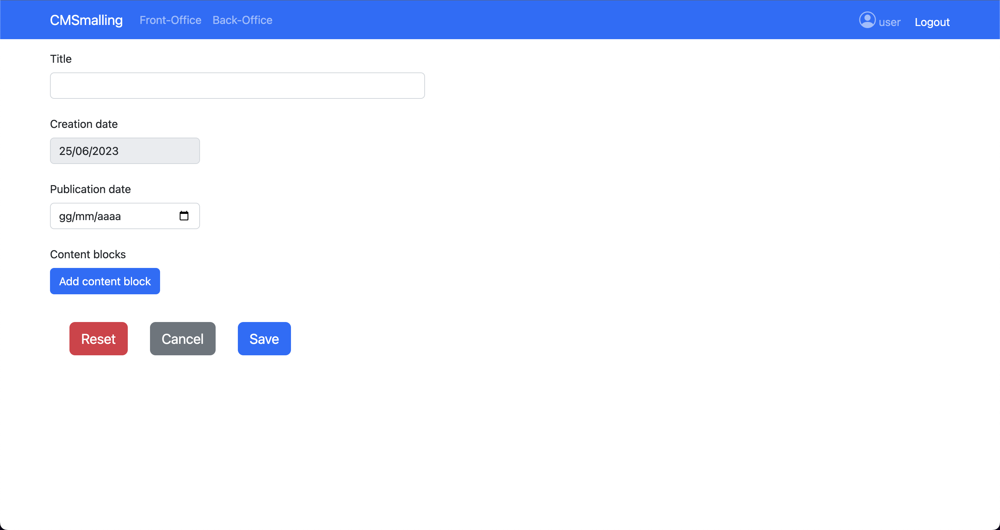
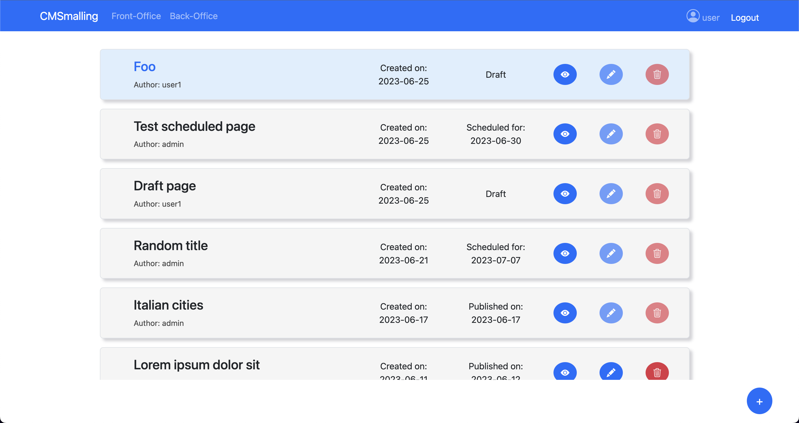

[](https://classroom.github.com/a/_XpznRuT)
# Exam #1: "CMSmall"

## Student: s314858 Chessa Alessio

# Server side

## API Server

- POST `/api/login`
  - Perform user authentication
  - request body:
    - `username`
    - `password`
  - response body: a message and user object with user info
    ``` JSON
      {
        "message": "Authenticated",
        "user": {
          "id": 2,
          "email": "admin@email.com",
          "username": "admin",
          "role": "Admin"
        }
      }
    ```

- GET `/api/pages/published`
  - Retrieve the list of all published pages
  - response body: array of page objects (without `blocks` field)
    ``` JSON
      [
        {
          "id": 1,
          "title": "Lorem ipsum",
          "author": "user",
          "creationDate": "2023-06-11",
          "publicationDate": "2023-06-17"
        },
        ...
      ]
    ```

- GET `/api/pages/published/:pageId`
  - Retrieve a published page by its id
  - request parameter:
    - `pageId`: positive integer that identifies the page
  - response body: page object that contains all the information about the page
    ``` JSON
      {
        "id": 1,
        "title": "Lorem ipsum dolor sit",
        "author": "user",
        "creationDate": "2023-06-11",
        "publicationDate": "2023-06-12",
        "blocks": [
          {
            "id": 34,
            "type": "header",
            "content": "Chapter 2",
            "position": 3
          },
          ...
        ]
      },
      ...
    ```

- GET `/api/pages`
  - Retrieve the list of all created pages
  - response body: array of page objects (without `blocks` field)
    ``` JSON
      [
        {
          "id": 1,
          "title": "Lorem ipsum",
          "author": "user",
          "creationDate": "2023-06-11",
          "publicationDate": "2023-06-17"
        },
        ...
      ]
    ```

- GET `/api/pages/:pageId`
  - Retrieve any page by its id
  - request parameter:
    - `pageId`: positive integer that identifies the page
  - response body: page object that contains all the information about the page
    ``` JSON
      {
        "id": 1,
        "title": "Lorem ipsum dolor sit",
        "author": "user",
        "creationDate": "2023-06-11",
        "publicationDate": "2023-06-12",
        "blocks": [
          {
            "id": 34,
            "type": "header",
            "content": "Chapter 2",
            "position": 3
          },
          ...
        ]
      },
      ...
    ```

- POST `/api/pages`
  - Create a new page
  - request body: a page object
    - author and creationDate are automatically added
    - publicationDate is optional
    - blocks should contain at least an header block and an image/paragraph block
    ``` JSON
      {
        "title": "test new page 2",
        "publicationDate": "2023-06-26",
        "blocks": [
          {
            "type": "header",
            "content": "Chapter 1",
            "position": 1
          },
          ...
        ]
      }
    ```
  - response body: the new page created, with all the fields
    ``` JSON
      {
        "id": 23,
        "title": "test new page 2",
        "author": "user1",
        "creationDate": "2023-06-25",
        "publicationDate": "2023-06-26",
        "blocks": [ ... ]
      }
    ```

- PUT `/api/authors/:authorId/pages/:pageId`
  - Update an existing page for which the user is the author
  - request parameters:
    - `authorId`: id of the author of the page (and also the user making the request)
    - `pageId`: id of the page to update
  - request body: page object without author and creationDate. If `blocks` is omitted, the old blocks are preserved
    ``` JSON
      {
        "title": "page updated",
        "publicationDate": "2023-06-26",
      }
    ```
  - response body: the updated page, with all the fields
    ``` JSON
      {
        "id": 23,
        "title": "page updated",
        "author": "user1",
        "creationDate": "2023-06-25",
        "publicationDate": "2023-06-26",
        "blocks": [ ... ]
      }
    ```

- DELETE `/api/authors/:authorId/pages/:pageId`
  - Delete an existing page for which the user is the author
  - request parameters:
    - `authorId`: id of the author of the page (and also the user making the request)
    - `pageId`: id of the page to delete
  - response body: a message of success and the number of deleted blocks of the page
    ``` JSON
      {
        "message": "Page deleted",
        "blocksDeleted": 2
      }
    ```

- PUT `/api/pages/:pageId`
  - Update an existing page changing also the author (admin only)
  - request parameters:
    - `pageId`: id of the page to update
  - request body: page object without creationDate. If `blocks` is omitted, the old blocks are preserved
    ``` JSON
      {
        "title": "page updated",
        "author": "newAuthor",
        "publicationDate": "2023-06-26",
      }
    ```
  - response body: the updated page, with all the fields
    ``` JSON
      {
        "id": 23,
        "title": "page updated",
        "author": "newAuthor",
        "creationDate": "2023-06-25",
        "publicationDate": "2023-06-26",
        "blocks": [ ... ]
      }
    ```

- DELETE `/api/pages/:pageId`
  - Delete an existing page (admin only)
  - request parameters:
    - `pageId`: id of the page to delete
  - response body: a message of success and the number of deleted blocks of the page
    ``` JSON
      {
        "message": "Page deleted",
        "blocksDeleted": 2
      }
    ```

- GET `/api/configs/websitename`
  - Retrieve the current name of the website
  - response body: an object containing the property `websiteName`
    ``` JSON
      { "websiteName": "CMSmall" }
    ```

- PUT `/api/configs/websitename`
  - Change the name of the website (admin only)
  - request body: an object containing the property `websiteName`
    ``` JSON
      { "websiteName": "CMSmall" }
    ```
  - response body: an object containing the property `websiteName` with the updated value
    ``` JSON
      { "websiteName": "CMSmall" }
    ```

- GET `/api/images`
  - Retrieve the list of images stored in the server
  - response body: array of file names
    ``` JSON
      [
        "cat.jpg",
        "dog.jpg",
        ...
      ]
    ```

## Database Tables

- Table `users` - contains all the information about the users (id, username, email, salt, hash, role)
- Table `pages` - contains all the pages (id, title, author, creation_date, publication_date)
- Table `blocks` - contains all the content blocks of the pages (id, type, content, position, page)
- Table `configs` - contains the configuration properties of the website - in this case only the current name of the website (property, value)

# Client side

## React Client Application Routes

- Route `/`: home page (front-office), shows the list of published page, doesn't require authentication
- Route `/pages/:pageId`: view a published page; all the information and content are shown to anyone, it doesn't require authentication
- Route `/back-office`: main page of the back-office, shows the list of all created pages to the authenticated user
- Route `/back-office/pages/:pageId`: view (or preview) any page, even if it is not published; it requires authentication
- Route `/back-office/edit/:pageId`: edit properties and content of a page, requires authentication and the user should be either admin or the author of the page
- Route `/back-office/add`: create a new page, requires authentication
- Route `/login`: route to perform authentication
- Route `/admin/dashboard`: dashboard for the admin, from where he can change the name of the website

## Main React Components

- `FrontOffice` (in `FrontOffice.js`): shows the list of published pages
- `BackOffice` (in `BackOffice.js`): shows the list of every created page, requires authentication; from here the user can: preview, edit, add and remove a page if they have authorizations
- `ViewPage` (in `ViewPage.js`): shows the full content of a page and its information
- `AddPage` (in `AddPage.js`): form to add a new page, contains EditBlocks component
- `EditPage` (in `EditPage.js`): form to edit an existing page, contains EditBlocks component
- `EditBlocks` (in `EditBlocks.js`): form to edit the list of content blocks in a page; blocks can be re-ordered, added or remove, and their content can be edited
- `LoginForm` (in `LoginForm.js`): form to perform login
- `AdminDashboard` (in `AdminDashboard.js`): dashboard for admin with form to change the website name

# Usage info

## Example Screenshot

Add page screen:



List of all pages (back-office):



## Users Credentials
| username | password |
|:--:|:--:|
| admin | admin |
| user | password |
| user1 | password |
| user2 | password |
